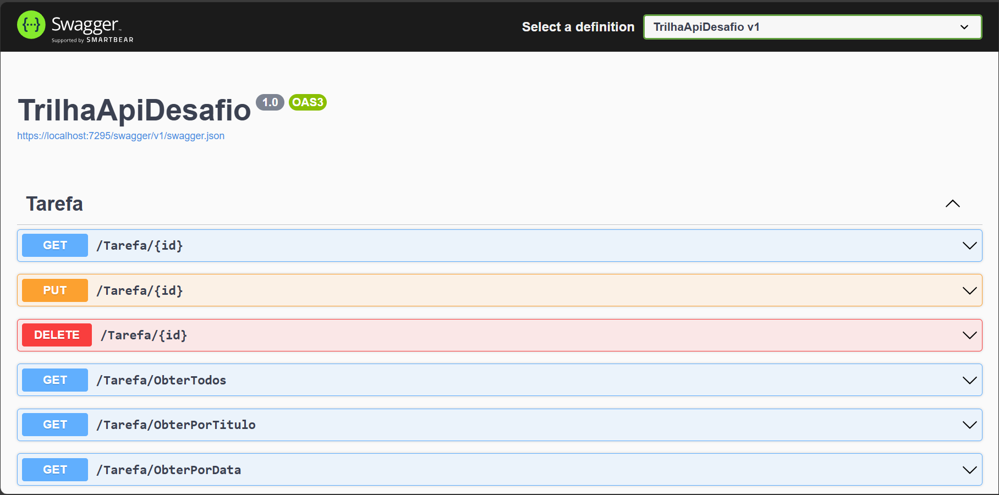

# DIO - Trilha .NET - API e Entity Framework
www.dio.me

## Desafio de projeto
Para este desafio, você precisará usar seus conhecimentos adquiridos no módulo de API e Entity Framework, da trilha .NET da DIO.

## Contexto
Você precisa construir um sistema gerenciador de tarefas, onde você poderá cadastrar uma lista de tarefas que permitirá organizar melhor a sua rotina.

Essa lista de tarefas precisa ter um CRUD, ou seja, deverá permitir a você obter os registros, criar, salvar e deletar esses registros.

A sua aplicação deverá ser do tipo Web API ou MVC, fique a vontade para implementar a solução que achar mais adequado.

A sua classe principal, a classe de tarefa, deve ser a seguinte:


Não se esqueça de gerar a sua migration para atualização no banco de dados.

## Métodos esperados
É esperado que você crie o seus métodos conforme a seguir:


**Swagger**


**Endpoints**


| Verbo  | Endpoint                | Parâmetro | Body          |
|--------|-------------------------|-----------|---------------|
| GET    | /Tarefa/{id}            | id        | N/A           |
| PUT    | /Tarefa/{id}            | id        | Schema Tarefa |
| DELETE | /Tarefa/{id}            | id        | N/A           |
| GET    | /Tarefa/ObterTodos      | N/A       | N/A           |
| GET    | /Tarefa/ObterPorTitulo  | titulo    | N/A           |
| GET    | /Tarefa/ObterPorData    | data      | N/A           |
| GET    | /Tarefa/ObterPorStatus  | status    | N/A           |
| POST   | /Tarefa                 | N/A       | Schema Tarefa |

Esse é o schema (model) de Tarefa, utilizado para passar para os métodos que exigirem

```json
{
  "id": 0,
  "titulo": "string",
  "descricao": "string",
  "data": "2022-06-08T01:31:07.056Z",
  "status": "Pendente"
}
```


## Solução
The code is complete and functional, meeting all the requirements listed above.

> This API was built using .NET version 6.0.428 and has a global.json file that configured the creation of this environment.

> This API has a default connection string of Sql Server, which was the DB used for local testing. Make whatever changes to the database you want, however, the string name is being accessed in Program.cs

> Swagger was used to interact with this application. It automatically opens in the .NET version of this API when we use the `dotnet watch run` command in the power shell terminal.
    
    

>To use this API, simply download this repository and have it on your machine:
>   - version 6.0 of .NET on the machine
>   - Entity Framework version 6
>   - package EntityFrameworkCore.Design version 6 
>   - package EntityFrameworkCore.SqlServer version 6
>       - They were used to make the Migrations. Believe me, the only thing missing is you, the user, using the: dotnet-ef database update